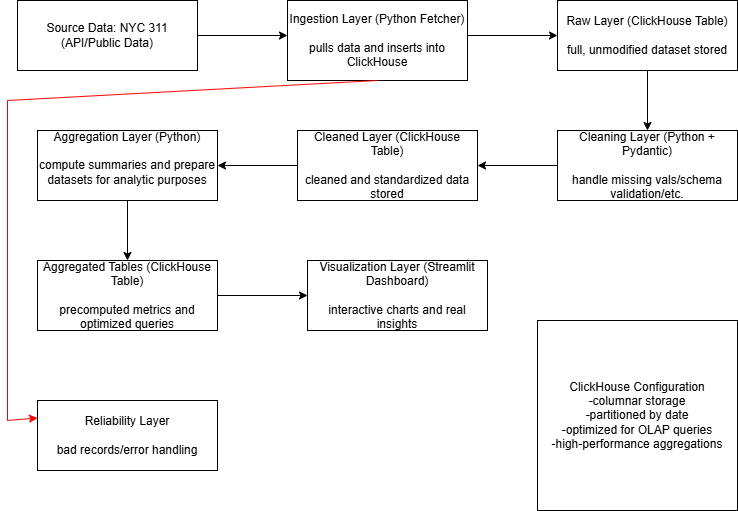
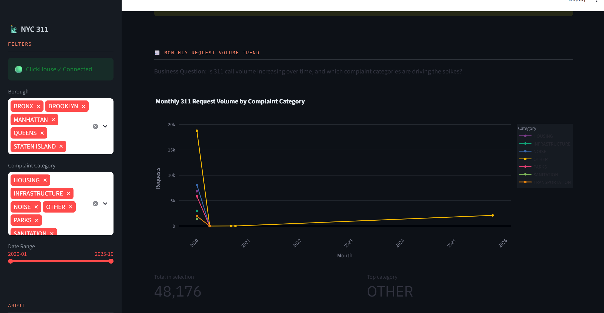
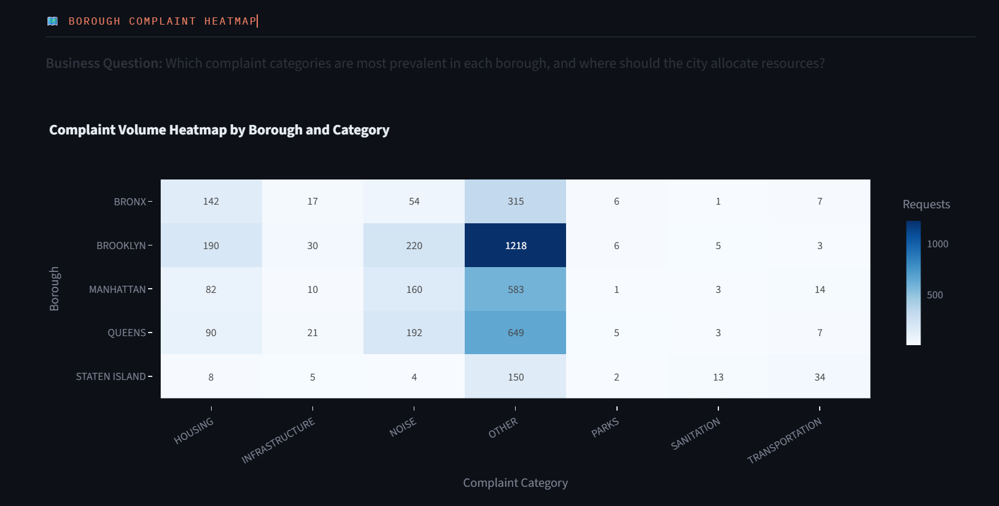
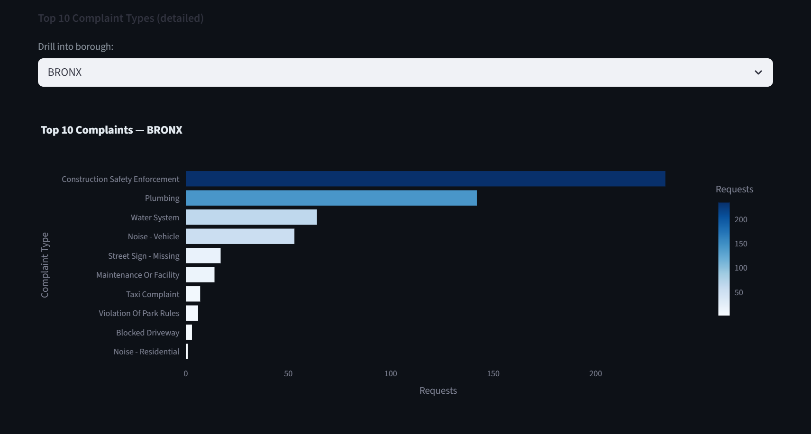
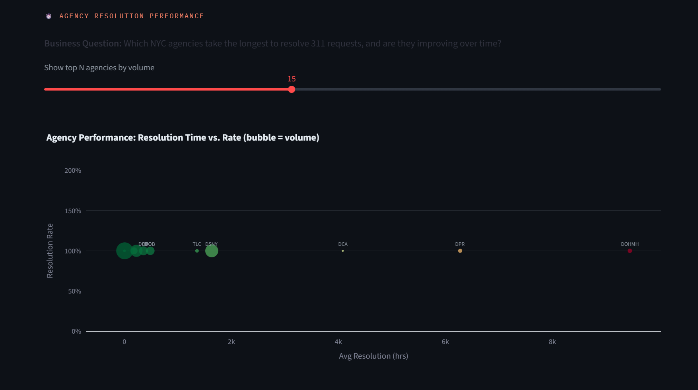
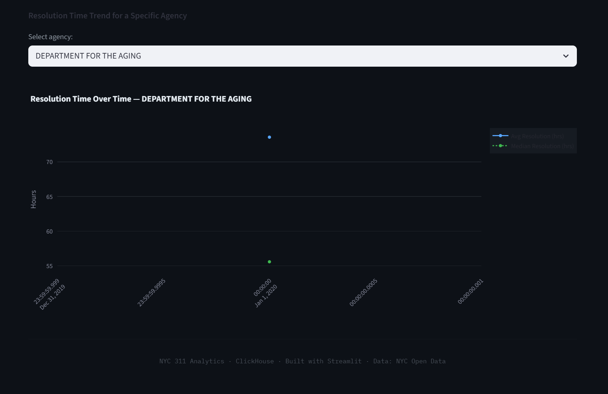

NYC 311 Big Data Pipeline
This project builds a full data engineering pipeline that processes ~35M NYC 311 service requests.

It demonstrates real-world Big Data engineering concepts:
- Distributed ingestion from NYC Open Data API
- Data cleaning + validation using Pydantic
- Aggregations for analytics use cases
- Interactive Streamlit dashboard

Business Questions Answered
- Are 311 request volumes increasing over time?
- Which complaint types dominate each borough?
- Which agencies take the longest to resolve requests?

Platform Choice: ClickHouse
ClickHouse was chosen because it is optimized for analytical workloads (OLAP).

Why ClickHouse:
- Supports columnar storage -> fast GROUP BY
- Uses partition pruning for time-based queries
- Handles millions of rows efficiently
Comparison:
- ClickHouse = best for analytics at scale
- MongoDB = general-purpose, slower aggregations
- Cassandra = optimized for writes, not analytics

 Dataset Description
- Source: NYC 311 Service Requests
- Size: ~35 million rows
- Time range: 2010 - present
- Format: JSON 

Key fields used:
- unique_key
- created_date, closed_date
- agency, borough
- complaint_type, descriptor 
- latitude, longitude
- status

Data challenges:
- Missing values
-Inconsistent categories
- Invalid coordinates
- Negative resolution times

Architecture
NYC Open Data API
        ↓
   fetcher.py
        ↓
  requests_raw (ClickHouse)
        ↓
   cleaner.py
        ↓
 requests_clean
        ↓
  aggregator.py
        ↓
 agg tables (3)
        ↓
 Streamlit Dashboard

Storage layers:
Raw layer: append-only ingestion layer
Clean layer: validated + standardized dataset
Aggregated layer: analytics-ready tables

Setup Instructions
Prerequisites
- Docker + Docker Compose
- Python 3.11+
- uv package manager (pip install uv)
- Optional: NYC Open Data API token

1. Clone repository
git clone https://github.com/wilson16598/nyc311-pipeline.git
cd nyc311-pipeline
2. Environment setup
cp .env.example .env
3. Start ClickHouse
docker compose up -d
docker compose ps   # verify all services are healthy
4. Install dependencies
uv sync
uv sync --extra dev
5. Verify connection
uv run python -c "from src.utils.clickhouse_client import ping; print('OK' if ping() else 'FAIL')"

Running the Pipeline
Full pipeline
- uv run python scripts/run_pipeline.py

Development run 
- uv run python scripts/run_pipeline.py --max-rows 500000

Run stages individually
--stage raw
--stage clean
--stage agg

Expected output
STAGE 1: RAW INGESTION
- Fetches NYC Open Data API in batches
- Validates with Pydantic (RawRequest)
- Stores in requests_raw (MergeTree)
- Handles bad records logging

STAGE 2: CLEAN LAYER
- Deduplicate on unique_key
- Parse and standardize timestamps
- Normalize text fields
- Validate borough names
- Clean ZIP codes
- Validate coordinates
- Fill missing values
- Remove invalid resolution times
- Cap extreme outliers
- Derive features

STAGE 3: AGGREGATIONS
We compute 3 analytics tables:
- Agency performance (speed + resolution rate)
- Borough complaint distribution
- Monthly trend analysis

7. Screenshots

### Architecture

## Monthly Trends

## Borough Heatmap

## Top 10 Complaints

## Agency Resolution Performance

## Resolution Time over Time

8. Team Members
Name	Role
You	Pipeline + ClickHouse architecture
Teammate 1	Data cleaning + models
Teammate 2	Aggregations + dashboard
Teammate 3	Testing + documentation

9. What We Learned

- ClickHouse enables fast OLAP at scale
- Real-world datasets are messy and inconsistent
- Partitioning is critical for performance
- Checkpointing is required for large ingestion jobs