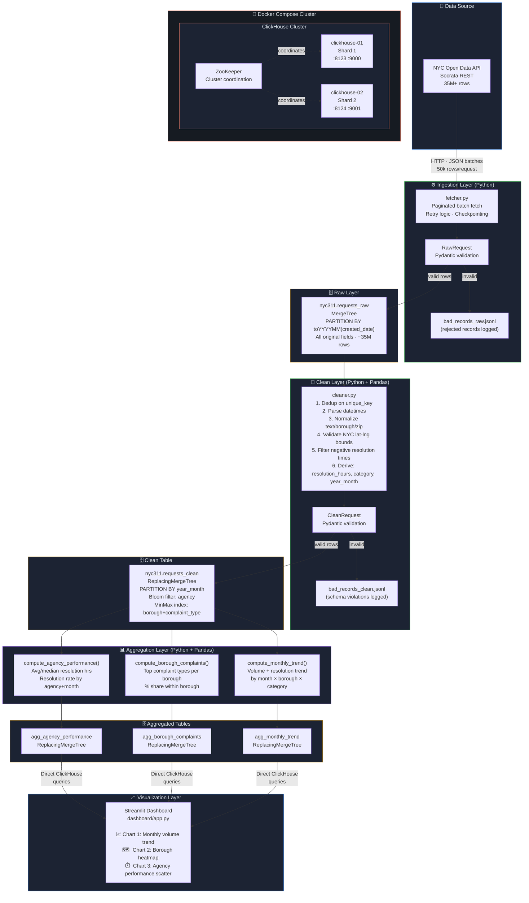

# NYC 311 Big Data Pipeline — Architecture

## System Diagram

## Layer Descriptions

### Source
NYC Open Data — 311 Service Requests from 2010 to present (~35M rows). Accessed via Socrata REST API in paginated JSON batches with optional app token authentication.

### Ingestion
Python fetches batches of 50,000 rows. Each record is validated via `RawRequest` (Pydantic). Bad records are written to `logs/bad_records_raw.jsonl` and never silently dropped. Checkpointing saves progress so restarts resume from the last successful batch.

### Raw Layer
`requests_raw` uses `MergeTree` partitioned by `toYYYYMM(created_date)`. This partitioning makes time-range scans dramatically faster and is the first performance decision in the pipeline.

### Clean Layer
10 cleaning steps applied in pandas (vectorized for performance), followed by `CleanRequest` Pydantic validation. Derives 3 new columns: `resolution_hours`, `complaint_category`, `year_month`. Uses `ReplacingMergeTree` so duplicate ingestion runs are idempotent.

### Aggregation Layer
3 purpose-built summary tables, each tied to a specific business question and visualization. Written back to ClickHouse so the dashboard queries the database directly — not flat files.

### Visualization
Streamlit app with live ClickHouse connections, borough/category/date filters, drill-down by agency, and 3 charts answering distinct business questions.

## Performance Decisions

| Decision | Rationale |
|---|---|
| `PARTITION BY year_month` | Most 311 queries filter by date range — partition pruning eliminates unread parts |
| Bloom filter on `agency` | Exact-match lookups on agency are common; bloom filter reduces granule scans by ~80% |
| MinMax index on `(borough, complaint_type)` | Supports the heatmap query which filters both dimensions |
| `ReplacingMergeTree` for clean/agg tables | Idempotent re-runs — duplicate keys are deduplicated in background merges |
| 2-node ClickHouse cluster | Demonstrates distribution; production would use `Distributed` engine for cross-shard queries |
